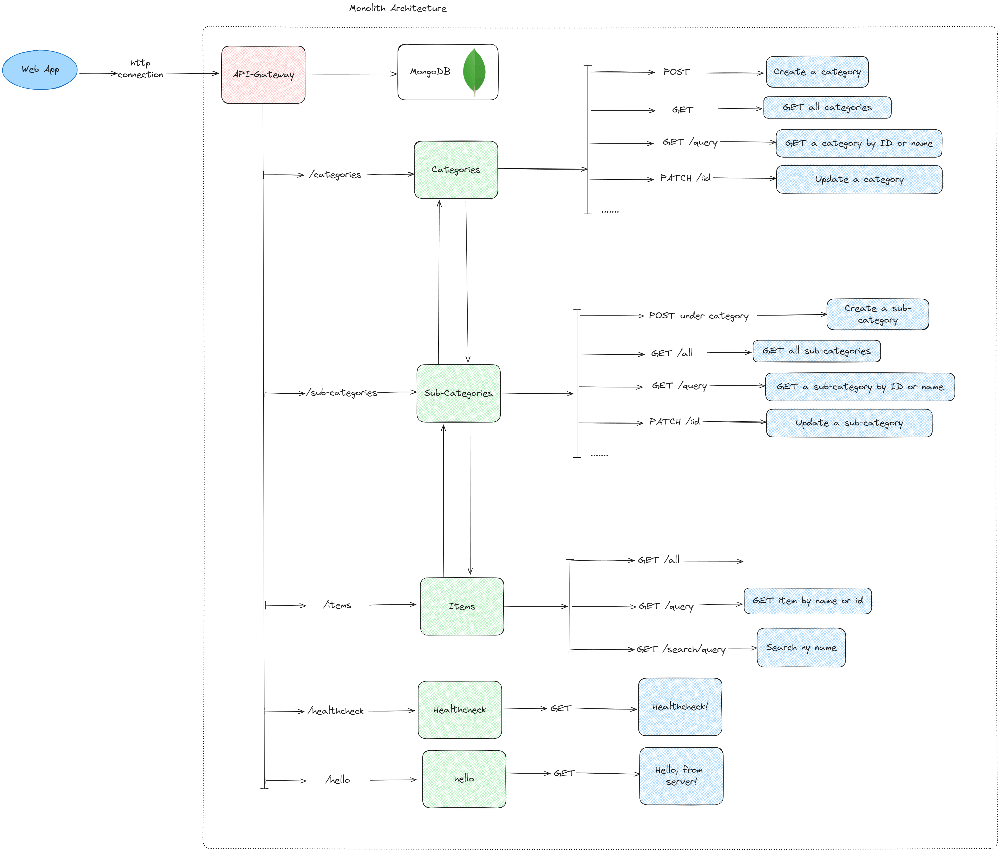

# Menu Management API

## Table of Contents

- [Overview](#overview)
- [Project Setup](#project-setup)
- [Environment Variables](#environment-variables)
- [Architecure](#architecture)
- [Testing](#testing)
- [Technologies Used](#technologies-used)
- [QnAs](#qnas)
- [Contributing](#contributing)
- [License](#license)
- [Future Improvements](#future-improvements)

## Overview

This project involves creating a Node.js backend server for menu management, divided into three main parts:
1. **Category**
2. **Subcategory**: A category can have multiple subcategories.
3. **Items**: A subcategory can have multiple items.

The API is designed to manage these entities efficiently, with functionalities to create, retrieve, update, and search within the system. This API can be tested using Postman.

* Deployed Link: [Menu Management API on Render](https://menu-management-api-u1ds.onrender.com/)

* Swagger Documentation: [API Documentation](https://menu-management-api-u1ds.onrender.com/api-docs/)

* Postman Collections: [Postman Collections](https://github.com/deepanshu-rawat6/menu-management-api/tree/master/.postman).

* Loom Video: [API Overview Video](https://www.loom.com/share/92afa3b5822c45b0bb6e0bf9fc110baa?sid=99399ff8-f41d-4669-829b-cd88e080ddbf)

* To know more about the endpoints: [API-Endpoints.md](https://github.com/deepanshu-rawat6/menu-management-api/blob/master/API-Endpoints.md)

## Project Setup

1. **Pre-requisites**
  
  - Node.js: 20 LTS, [click here](https://nodejs.org/en/download/package-manager) if not installed
  - Docker with docker-compose, [click here](https://www.docker.com/products/docker-desktop/) if not installed
  - Postman or cURL, [click here](https://www.postman.com/downloads/) if not installed

2. **Clone the Repository**

    ```bash
    git clone https://github.com/deepanshu-rawat6/menu-management-api.git
    cd menu-management-api
    ```

3. **Install Dependencies**

    ```bash
    npm install
    ```

4. **Set Up Database**
  
  - As said in the assignment, to any assignment, so I have choosen `MongoDB`, along with `Prisma` as an `ORM`.

  - Configuring Prisma to connect to your database.

    ```bash
      npx prisma init
    ```

  - After design/modifying the schema, run the following command to update the `Prisma/Client`:

    ```bash
      npx prisma generate
    ```

5. **Run the application**

  - We have two method of running the application, locally either by `Node.js` or `Docker`:

  - In order to run with Docker, we use the `docker-compose.dev.yml`, with the command:

  ```bash
    docker-compose -f docker-compose.dev.yml up
  ```

  - Otherwise, you can simply run, with the help of Node.js with the command:

  ```bash
    npm run dev
  ```

  - In case, to just test the API, we can use the deployed link: [Menu Management API on Render](https://menu-management-api-u1ds.onrender.com/)

## Environment Variables

You need to create a `.env` file in the root directory to store your environment variables. Here's an example of what it might include:

```.env
DATABASE_URL= <DATABASE_URL>

PORT= <PORT_NUMBER>
DB_USER= <DB_USER>
DB_PASSWORD= <DB_PASSWORD>
```

## Architecture



## Testing

To test the API endpoints, you can use Postman or cURL or any other API testing tool.

1. **Postman Collection**: Use the Postman Collection provided in the repository to import all the requests and environment variables.

2. **Swagger Documentation**: The Swagger UI provides a user-friendly interface to test and explore all available API endpoints.

## Technologies Used

* Node.js
* Express.js
* MongoDB (NoSQL Database)
* Prisma (ORM)
* TypeScript
* Swagger (API Documentation)
* Zod (Validation)
* Pino (Logging)

## QnAs

### Why did I choose MongoDB here?

  ```
  MongoDB: Found a NoSQL DB to be better for this use case, and out of those Mongo was the best. Also, it was supported by prisma so another plus point.
  ```

### What are my learning outcomes form the assignment?
  ```

  - zod 
    - For schema validation by:
      - Validator middleware
      - Custom schema for validation

  - swagger-docs
    - API Documentation in YAML format

  - Types of requests(params, query parameters and path parameters) along with advanced logging and error handling
    - Logging using pino, pino-pretty logger
    - Error handling using extensive try catch in controllers

  ```

### What was the most difficult part of the assignment?

```
Generating Swagger configurations and thoroughly testing the API endpoints were the most challenging parts.
```

### What you would have done differently given more time?

```
Instead of a monolithic architecture, I would have opted for a microservices-based architecture, incorporating user authentication and authorization to secure protected routes.
```

## Contributing

If you'd like to contribute to this project, please follow these steps:

1. Fork the repository.
2. Create a new branch (git checkout -b feature/YourFeature).
3. Commit your changes (git commit -m 'Add some feature').
4. Push to the branch (git push origin feature/YourFeature).
5. Open a Pull Request.

## License

This project is licensed under the MIT License. See the [LICENSE](https://github.com/deepanshu-rawat6/menu-management-api/blob/master/LICENSE) file for details.

## Future Improvements

Given more time, here are some improvements that could be made:

  * Microservices Architecture: Splitting the project into smaller services for scalability and maintainability.

  * Authentication & Authorization: Adding user authentication and role-based access control to protect certain routes.

  * Performance Optimization: Implementing caching strategies and optimizing database queries for better performance.

  * Automated Testing: Adding unit and integration tests to ensure code quality and reliability.